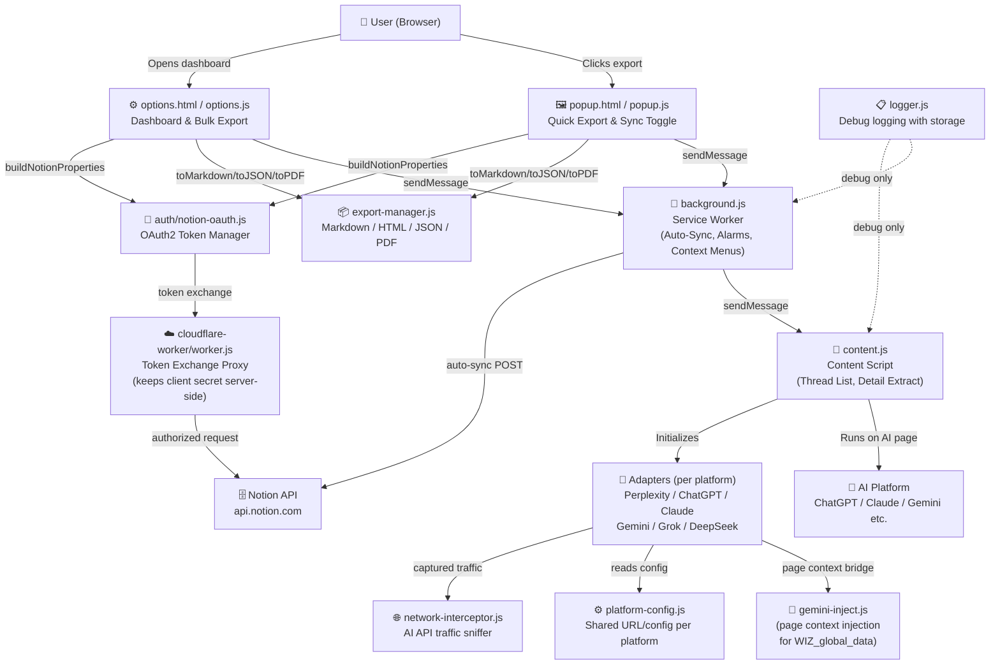

# OmniExporter AI — Architecture Overview

## High-Level Component Map



## Data Flow: Save to Notion (Manual)

```
User clicks "Save to Notion"
  → popup.js getThreadDataFromContentScript()
    → content.js EXTRACT_CONTENT_BY_UUID
      → Adapter.getThreadDetail(uuid)
        → AI Platform API (fetch with credentials)
      → returns { uuid, title, entries[], platform }
  → popup.js syncToNotionAPI(data, apiKey, dbId)
    → buildNotionProperties(data) → Notion page properties
    → POST /v1/pages  (first 100 blocks)
    → PATCH /v1/blocks/{id}/children  (remaining blocks, 100 at a time)
```

## Key Files

| File | Role |
|---|---|
| `src/background.js` | Service worker — alarms, auto-sync, message routing |
| `src/content.js` | Injected into AI tabs — adapter orchestration |
| `src/ui/popup.js` | Quick export popup |
| `src/ui/options.js` | Full dashboard (bulk export, history, settings) |
| `auth/notion-oauth.js` | OAuth2 token management (authorize, store, re-auth) |
| `cloudflare-worker/worker.js` | Token exchange worker (keeps client secret safe) |
| `src/adapters/*.js` | One file per AI platform |
| `src/utils/export-manager.js` | Export to Markdown, HTML, JSON, PDF |
| `src/utils/logger.js` | Buffered, filterable debug logger |
| `src/utils/network-interceptor.js` | Passive XHR/Fetch sniffer for chat list auto-detection |
| `src/platform-config.js` | Platform URLs, UUID patterns, API base paths |
| `config.js` (gitignored) | Your Notion Client ID + OAuth worker URL |

## Security Model

- **Client secret** lives only in the Cloudflare Worker env var — never in the extension
- **Tokens** stored in `chrome.storage.local` (plain JSON, OS-level isolation per user)
- **CORS** on the worker is restricted to your `chrome-extension://EXTENSION_ID` origin
- **postMessage** in Gemini adapter uses `https://gemini.google.com` as the target origin
- **NetworkInterceptor** only processes URLs matching known AI platform API patterns

## Adding a New Platform

1. Create `src/adapters/myplatform-adapter.js` with `getThreads(page, limit)` and `getThreadDetail(uuid)` methods
2. Register the platform in `src/platform-config.js`
3. Add `matches` entry in `manifest.json` `content_scripts`
4. Add the domain to `host_permissions` in `manifest.json`
5. Add the platform URL builder to `PLATFORM_URLS` in `popup.js` and `options.js`
